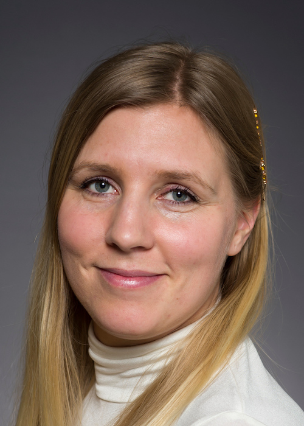
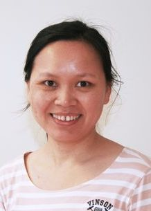
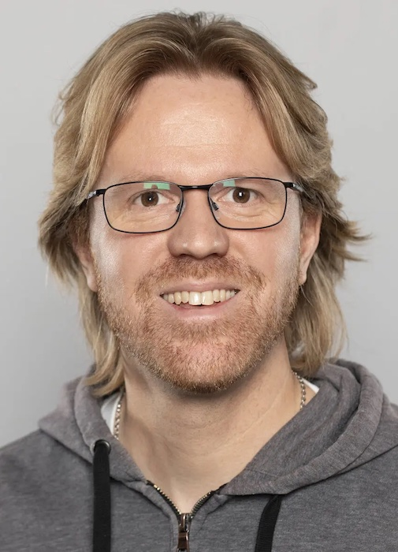
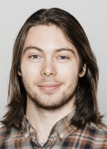
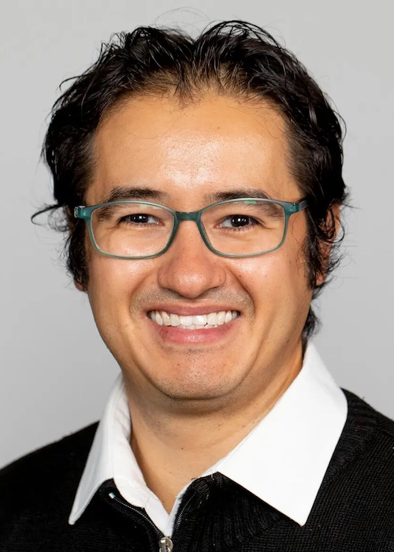
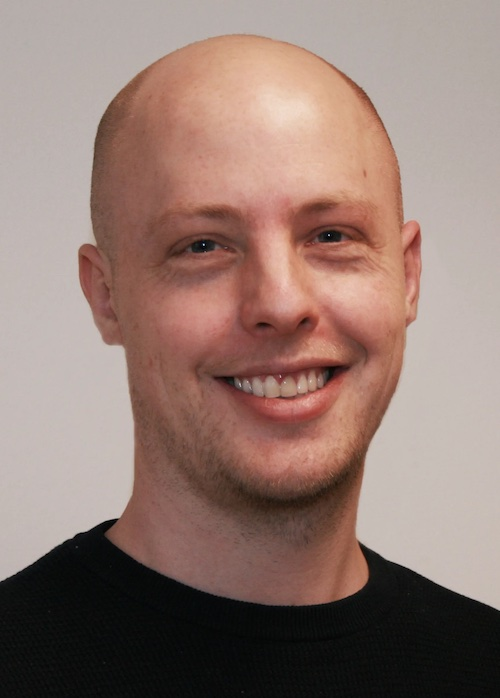

import '@/styles/home.css';

The ELIXIR node at Ås is part of Centre for Integrative Genetics (CIGENE), Department of Animal and Aquacultural Sciences, 
Faculty of Biosciences, at the Norwegian University of Life Sciences (NMBU).

 

We are an active partner in both the International Cooperation to Sequence the Atlantic Salmon Genome (ICSASG) and 
coordinating the EU Horizon 2020 project Advancing European Aquaculture by Genome Functional Annotation (AQUA-FAANG). 
The Ås node will make fish genomic resources available to the ELIXIR-network, with a particular focus on the Atlantic 
salmon genome. Web based solutions and e-infrastructure for analysing and sharing species-specific and comparative 
genomics resources are currently under development.

 
**Members**
 
||||||
:-:|:-:|:-:|:-:|:-:
  |  |  |  | 
  |  | | | | 

First row from left to right: Simen Rød Sandve (Node leader), Helle Tessand Baalsrud (WP6 leader), Thu-Hien To, Lars Grønvold, Gareth Gillard

Second row: Arturo Vera-Ponce de Leon, Marius Andre Strand
