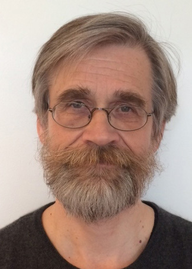
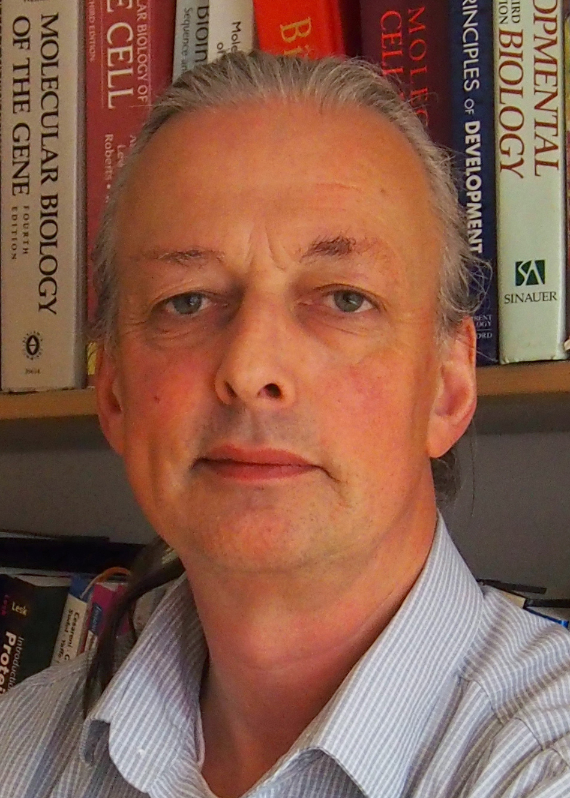
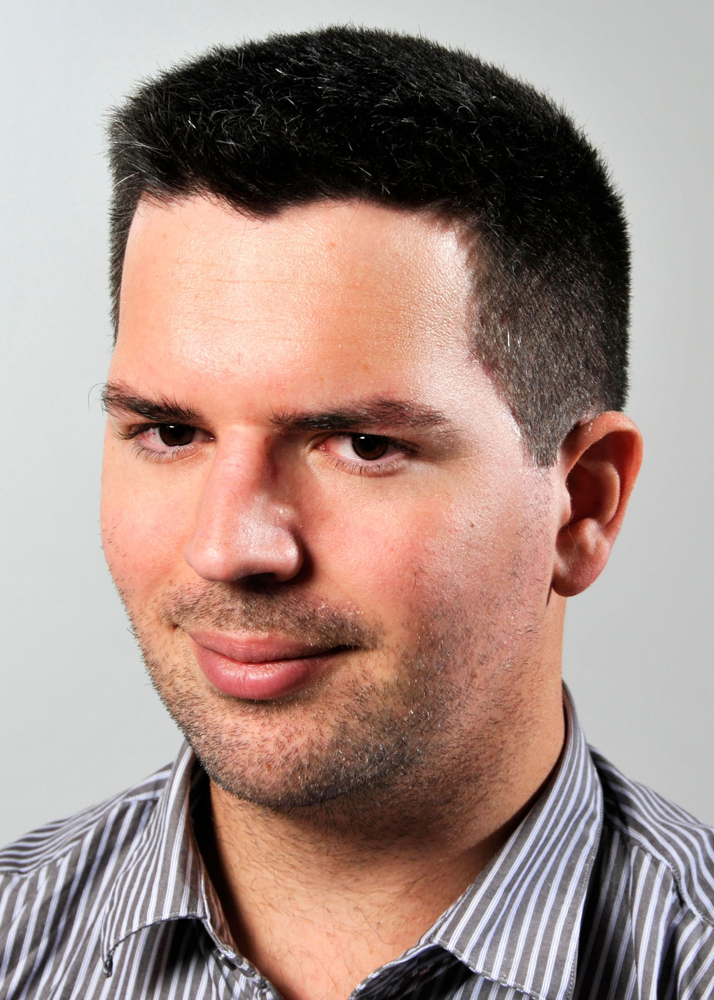
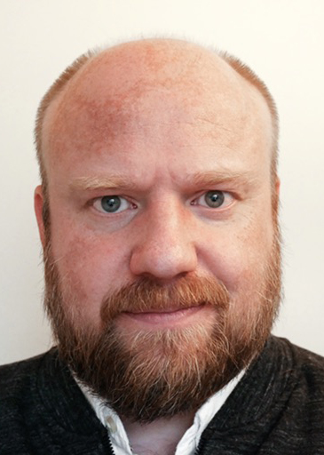

import '@/styles/home.css';

The ELIXIR Norway [University of Oslo](https://www.uio.no/english) (UiO) node, located at the [Center for Bioinformatics](https://www.mn.uio.no/sbi/english), has a strong focus on bioinformatics within the health domain and research questions related to medical sciences, especially cancer research. The node is involved in developing solutions for handling and analysing sensitive omics data within the [Federated EGA Norway node](https://ega.elixir.no) (FEGA).  
 
The Oslo node also closely collaborates with the [Bioinformatics Core Facility](https://www.ous-research.no/bioinformatics) at the [Oslo University Hospital](https://www.ous-research.no). The core facility currently is also involved in developing Precision Diagnostics analytics. The node has special competences in:
 
* Data management and data management planning services, including
  * The Norwegian national resource at the European [Research Data management toolkit](https://rdmkit.elixir-europe.org) (RDMkit) resource, [RDMkit Norway](https://rdmkit.elixir-europe.org/no_resources)
  * ELIXIR Norway's instance of the [Data Stewardship Wizard](https://elixir-no.ds-wizard.org) (DSW) that has been developed to help researchers and data stewards with building Data Management Plans (DMPs) for [FAIR](https://www.go-fair.org/fair-principles/) Open Science
* High-throughput sequencing data analysis
* Metagenomics data analysis
* Functional genomics
* Transcriptomics
* Single Cell transcriptomics
* Methylation data analysis
* Proteomics data analysis
* Protein structure analysis
* Programming/scripting for biomedical applications
* Development of databases and web services for bioinformatics and biomedical research
 
Other important contributions from the ELIXIR Norway Oslo node are to the [GSuite/Genomic Hyperbrowser](https://hyperbrowser.uio.no), the [JASPAR](https://jaspar.elixir.no) database of transcription factor binding profiles, the [FAIRtracks](https://fairtracks.net) ecosystem, the [Omnipy](https://pypi.org/project/omnipy) high-level Python library for type-driven data wrangling and scalable workflow orchestration, and the [MidGeneDB](https://mirgenedb.org) database of curated microRNA genes. 
 
# **Head: Eivind Hovig**

||||||
:-:|:-:|:-:|:-:|:-:
 |  |  |  | 

||||||
:-:|:-:|:-:|:-:|:-:
 |  |  |  | 

 
**Top row:** Eivind Hovig (Node leader), Rein Aasland, Jon K. Lærdahl, Federico Bianchini, and   Nazeefa Fatima  
**Second row:** Sveinung Gundersen and Annbjørg Barbakken
 
**Other members of the Oslo node:**

Victor Michael Kalbskopf, Pável Vázquez Faci, Martina Visnovska, Fabian Leonardo Martinez Bernal, Morten Mattingsdal, Jeanne Marie Cheneby, and Morten Johansen   
